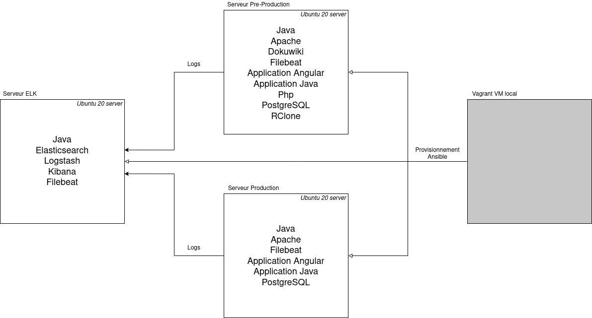
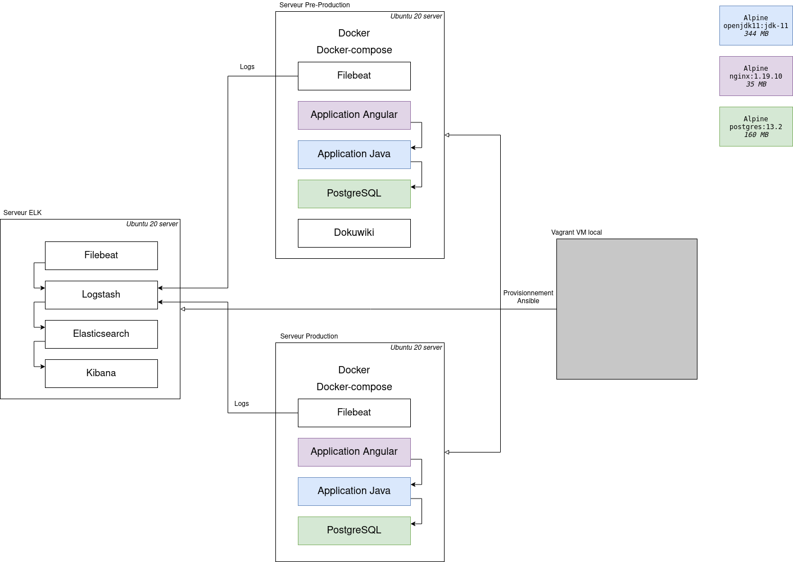

# Fil rouge Aston POEC groupe 2

## Prerequis

- Ansible 2.9.6
- Java 11
- Maven 3.6.3
- Angular 10
- Docker 20.10.5
- Docker-compose 1.29.1

## Structure projet

Le projet est composé de plusieurs systemes, chacun étant dans des dossiers séparés.  
Des instructions pour chaque systeme sont disponibles dans chacun de leur dossier respectif.

### Ansible

Le dossier ansible contient tous les scripts de provisionnement pour déployer : 

- L'application avec la partie front Angular, la partie back Java et la base de donnée PostgreSQL
- Un Wikipedia personnel avec différents tutoriels sur les outils utilisés tout au long du projet
- La stack ELK pour la gestion des logs de l'application

Elle comprend également toute la partie de création des différents utilisateurs ainsi que la configuration des différents serveurs (sécurité, packages de base, dépendances)

### Application

Le dossier application contient une application de gestion pour bibliotheque

L'application comprend une partie Angular pour l'interface (UI) et la partie Java pour l'API REST (APP)

Elle est déployable en local sous docker avec un docker-compose ou à la main via Maven et Angular

### BDD

Ce dossier contient les différents schémas de conception de la base de donnée ainsi que les scripts de mise en place.  
Il y a également un script pour injecter un jeu de données de test

### Sauvegarde

Le dossier sauvegarde comprend les scripts permettant de mettre en place un systeme de back-up

### Vagrant

Ce dossier comprend les scripts de provisionnement pour mettre en place un environnement de developpement virtualisé, avec toute les dependances necessaires au projet

## Architecture des serveurs

### DockerLess

### DockerFull

