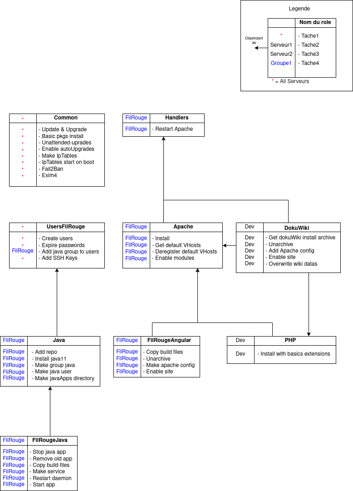
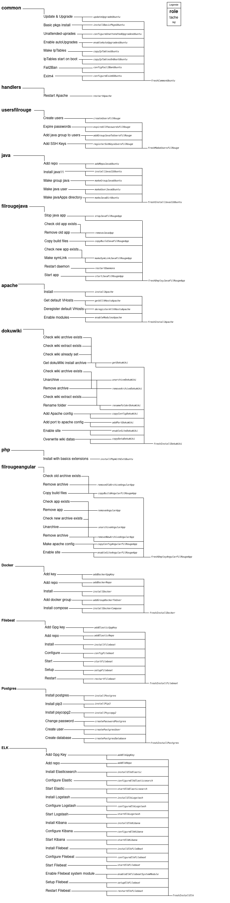

# Ansible


## Decryptage avec Vault

Pour pouvoir lancer le provisionnement, ansible utilise des fichiers de variables cryptés afin de proteger les données sensible.  
Afin de pouvoir décrypter les fichiers, ansible a besoin de la clé utilisée pour le cryptage.  
Il faut donc dans un premier temps, récupérer cette clé.  
La meilleure méthode est d'insérer cette clé dans vos variables d'environnement.  

Pour ce faire, créez un dossier sur votre systeme qui contiendra la clé.  
Créez un fichier vaultPassword.txt

```shell
# Chemin à adapter à vos besoins
mkdir /path/to/deep/dark/place
touch /path/to/deep/dark/place/vaultPassword.txt
```

Ensuite, récupérez la clé auprès de quelqu'un du groupe qui l'a déjà et copiez-la dans le fichier precedement créé.  
Attention, le fichier ne doit contenir que la clé sur une seule ligne et rien d'autre.  
Changer les droits sur le fichier pour la sécuriser.  

```shell
# Lecture et ecriture seulement pour le proprietaire (votre user)
chmod 600 /path/to/deep/dark/place/vaultPassword.txt
```

Enfin, il faut ajouter le chemin vers cette clé dans vos variables d'environnement : 

```shell
# Ajout d'une ligne à la fin du fichier
echo export ANSIBLE_VAULT_PASSWORD_FILE="/path/to/deep/dark/place/vaultPassword.txt" >> ~/.bashrc
# Refresh
source ~/.bashrc
```

A ce stade, ansible devrait pouvoir récupérer votre clé automatiquement.  
Cela evitera qu'il vous la demande à chaque execution du playbook.  

## Provisionnement

##### <span style="color:red">*Attention l'inventory est sur le serveur de production !!*</br>*Ne faites pas vos tests dessus !!*</br>*Il faut changer l'adresse ip du serveur pour la remplacer avec un serveur dédié au tests*</span>

### Modifier les fichiers cryptés (notamment les adresses des remotes)

Les adresses et passwords des remotes sont cryptés, pour pouvoir les modifier, il faut utiliser la commande vault : 

```shell
# Edition d'un fichier crypté ( chemin à adapter )
ansible-vault edit /path/fichier
```

Pour ce projet, les hosts sont définis dans 'host_vars/'  
Il y a un dossier par host et les informations sont dans vault.yml  

Par exemple, pour modifier l'adresse et le mot de passe de l'host 'devfilrouge' :  

```shell
ansible-vault edit host_vars/devfilrouge/vault.yml
```

Une fois que votre inventory pointe bien vers vos machines de test, vous pouvez passer au lancement du playbook.  

### Lancement du playbook

Avant de lancer le playbook, il faut déjà tester la connectivité sur vos machines remotes.  
Pour se connecter, ansible passe par le SSH, il faut donc tout d'abord propager votre clé vers les remotes.  

```shell
# Propage la clé SSH situé dans le dossier .ssh de votre home directory vers une destination
# (remplacer le chemin et l'utilisateur/adresse en fonction de vos besoins)
ssh-copy-id -i ~/.ssh/id_rsa.pub user@IP
```
Ensuite, nous allons tester la connectivité de vos machines avec un ping.  
Selon vos besoins, choisissez la commande qui vous est approprié.  

```shell
# Ping sur tous les hosts present dans l'inventory 
ansible -m ping all
# Ping sur une machine en particulier, devfilrouge pour ce cas
# Il est possible de choisir tout un groupe ou une machine en particulier
# Les noms sont définis dans le fichier .inventory
ansible -m ping devfilrouge
```

Si success, vous pouvez lancer le playbook pour provisionner les remotes.  
Dans notre cas, le playbook provisionne 3 machines.  
Pour vos tests, je vous conseil de limiter sur une seule machine.  
Ouvrir 4 vms sur vos postes et lancer un provisionnement risque de consommer trop de ressources et vos postes pourraient ne pas aimer.  
Ou alors, assurez vous que les vms aient peu de RAM allouée ( max 2Go ) et fermer tous vos processus couteux en ressources comme chrome ou autre.  

Choisissez la commande qui correspond à vos besoins pour lancer le playbook :  

```shell
# Lance le playbook sur toutes les machines repertoriées dans l'inventory
ansible-playbook playbook.yml
# Lance le playbook sur un groupe ou une machine en particulier (devfilrouge dans l'exemple)
ansible-playbook playbook.yml --limit devfilrouge
# Lance le playbook sur une ou plusieurs taches qui possedent le ou les tags renseignés
ansible-playbook playbook.yml --tags "nomDuTag"
# Lance le playbook sur toutes les taches sauf les tags renseignés
ansible-playbook playbook.yml --skip-tags "nomDuTag"
```

Remarque : Vous pouvez combiner les commandes pour par exemple lancer le playbook sur un host et un tag précis.  

```shell
ansible-playbook playbook.yml --limit devfilrouge --tags "nomDuTag"
```

## Sécuriser DokuWiki

Si vous installez le wiki sur un serveur, attention, il faut le parametrer en ajoutant un superUser.  
Si vous ne le faites pas, votre wiki sera accessible et modifiable par tout le monde !  
Pour ce faire, allez sur l'url ci-dessous en adaptant l'adresse à votre serveur :

http/://ipServeur:8081/install.php

Options à régler : 

- Mettre le wiki en privé
- Ne pas permettre l'inscription
- Ne pas envoyer de données vers dokuwiki

Le reste dépend de vos besoins.

## Cartographie

### Rôles, tâches et dépendances



### Tags

