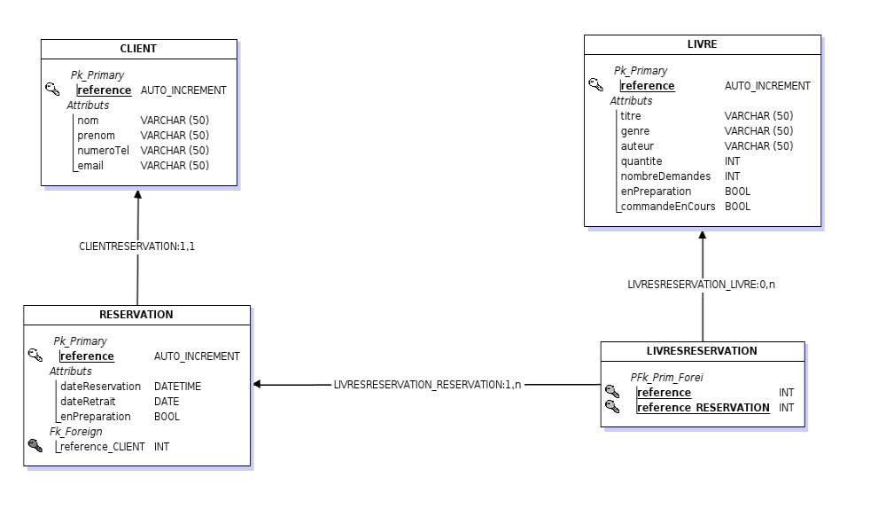

# Base de donnée
## Prerequis

- PostgreSQL v12.6

## Description

Ce repertoire contient deux scripts SQL : 

- Initialisation de la base
- Insertion d'un jeu de données de test

Attention, si vous utilisez le jeu de donnée, il faudra modifier la sequence hibernate pour démarrer à 18.

## MLD

